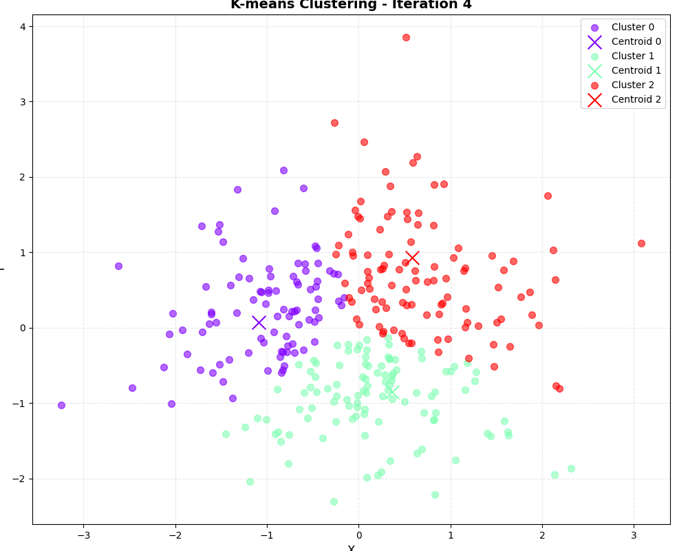

# robotics_2025
こちらは，千葉工業大学大学院 先進工学研究科 未来ロボティクス専攻1年次 後期の講義で取り扱われているリポジトリになります．
本リポジトリには課題として作成した`k-means.py`が含まれています．

## 概要
このプログラムは，教師なし学習の代表的な手法である**K-means法**を実装しました．
NumPyを用いたK-meansアルゴリズムの実装と、その収束過程をアニメーションで可視化するプロジェクトです．

## 環境構築
### 1. 依存ライブラリのインストール
```bash
pip install numpy matplotlib
```
### 2. 実行
```bash
python3 k-means.py
```

### 主な特徴
* **依存ライブラリ最小限**: `scikit-learn`を使わず，NumPyによるベクトル演算でアルゴリズムを実装．
* **アニメーション表示**: 各イテレーションでの重心（Centroid）の移動を`matplotlib.animation`で動的に表現．
* **柔軟なパラメータ**: データ数、次元数、クラスタ数（$k$），シード値を自由に変更可能．


## アルゴリズムの仕組み

本コードでは以下の「EMアルゴリズム」に基づいたステップを実行しています．

### K-meansアルゴリズムの数式表現

1. **初期化 (Initialization)**
	- データ点 $\{\mathbf{x}_1, \mathbf{x}_2, \ldots, \mathbf{x}_N\}$ からランダムに $k$ 個の重心（セントロイド） $\{\mathbf{\mu}_1, \ldots, \mathbf{\mu}_k\}$ を選ぶ．

2. **割り当てステップ (Assignment / E-step)**
	- 各データ点 $\mathbf{x}_i$ について、最も近い重心 $\mathbf{\mu}_j$ を求め、クラスタラベル $c_i$ を次式で決定．
	  $$
	  c_i = \underset{j \in \{1, \ldots, k\}}{\arg\min} \; \| \mathbf{x}_i - \mathbf{\mu}_j \|_2
	  $$

3. **重心更新ステップ (Update / M-step)**
	- 各クラスタ $j$ について、割り当てられた点の平均を新たな重心とする．
	  $$
	  \mathbf{\mu}_j = \frac{1}{N_j} \sum_{i: c_i = j} \mathbf{x}_i
	  $$
	  ここで $N_j$ はクラスタ $j$ に属する点の数．

4. **収束判定 (Convergence)**
	- 重心 $\mathbf{\mu}_j$ の位置が変化しなくなる（$\mathbf{\mu}_j^{\text{old}} \approx \mathbf{\mu}_j^{\text{new}}$）まで2, 3を繰り返す．

---

### 実行結果
